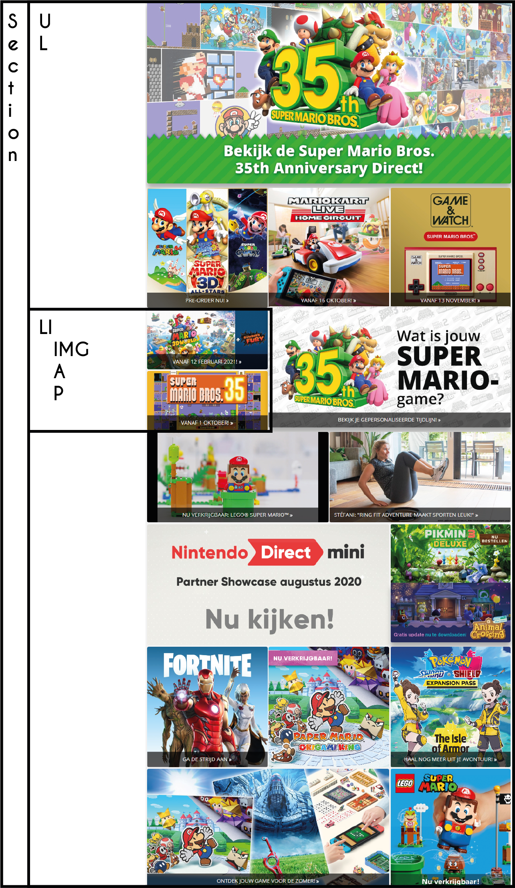

# Procesverslag
**Auteur:** Mark Schutte

## Bronnenlijst
1. https://www.nintendo.nl/
2. https://codepen.io/LantareCode/pen/dOXmBJ
3. https://cssgrid-generator.netlify.app/
4. https://www.sitepoint.com/css-grid-generators/ 
5. https://community.adobe.com/t5/dreamweaver/expected-rbrace-at-line-4-col-2-is-this-error-a-bug/td-p/10547718?page=1
6. http://csslint.net/
7. https://developer.mozilla.org/en-US/docs/Web/CSS/Media_Queries/Using_media_queries
8. https://www.w3schools.com/howto/tryit.asp?filename=tryhow_css_arrows
9. https://www.wikihow.com/Add-Facebook-Plugin-to-Website
10. https://developers.facebook.com/docs/plugins/page-plugin
11. https://code-boxx.com/simple-responsive-pure-css-hamburger-menu/
12. https://css-tricks.com/working-with-javascript-media-queries/
13. https://www.w3schools.com/howto/howto_js_media_queries.asp

**Je focus:** Responsive

**Je opdracht:** https://www.nintendo.nl/ , https://www.nintendo.nl/Games/Nintendo-Switch/Super-Smash-Bros-Ultimate-1395713.html

**Screenshot(s):**

**Breakdown-schets(en):**

